# Plotting

Tungsten's plotting domain allows you to visualize mathematical expressions directly from your editor.
By leveraging the plotting capabilities of the configured backends you are able to render high-quality 2D and 3D figures, which are then automatically inserted into your document.

This domain is designed to be "smart", in the way that it analyzes the structure of your expressions to automatically determine the most appropriate plot type (e.g. distinguishing between a 2D curve and a 3D surface).

## Basic Usage

To create a plot, visually select a mathematical expression and run `:TungstenPlot`.
Tungsten will then:
1. Parse the selection.
1. Classify the plot type
1. Render the plot using the active backend.
1. Insert the resulting \includegraphics-string with the correct path into your buffer.


## 2D Plotting Types

Tungsten supports a wide range of 2D plot types. These are all explained underneath.

### Explicit Functions

These are standard functions of one variable (e.g. `x`).
Tungsten assumes the result maps to `y` (unless the explicit variable is `y`, in which case the result is assumed to map to `x`.

```latex
\sin(x) \cdot e^{-\frac{x}{5}}
\includegraphics[width=0.8\linewidth]{tungsten_plots/plot_001}

\cos(y) \cdot e^{x/5}
\includegraphics[width=0.8\linewidth]{tungsten_plots/plot_002}
```


| **Plot_001** | **Plot_002** |
| :---: | :---: |
|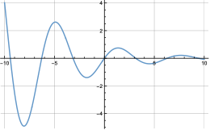| 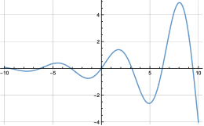|

### Implicit Equations

These are equations relating two variables (usually `x` and `y`).
They are typically used for circles, ellipses, and other curves where `y` cannot be easily isolated.

```latex
x^2 + y^2 = 4
\includegraphics[width=0.8\linewidth]{tungsten_plots/plot_001}

\frac{p^2}{4} + \frac{q^2}{9} = 1
\includegraphics[width=0.8\linewidth]{tungsten_plots/plot_002}
```


| **Plot_001** | **Plot_002** |
| :---: | :---: |
|| |


### Inequalities

For regions defined by inequality operators (`<`, `>`, `≤`, `≥`, `\leq`, `geq`, etc.) the backend will shade the region satisfying the condition.

```latex
y < \sin(x)
\includegraphics[width=0.8\linewidth]{tungsten_plots/plot_001}

x \cdot y \leq 2 \cdot y
\includegraphics[width=0.8\linewidth]{tungsten_plots/plot_002}
```


| **Plot_001** | **Plot_002** |
| :---: | :---: |
|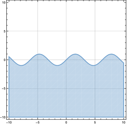| 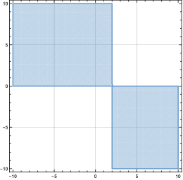|

*Note*: Chained inequalities such as `- \sin(x) < y < \sin(x)` are not currently supported for either backend.

### Parametric Curves

Tuples of two functions depending on a single parameter (usually `t`) are parsed as parametric curves.
The first element maps to the first axis, and the second to the second axis.

```latex
(\cos(3t), \sin(2t))
\includegraphics[width=0.8\linewidth]{tungsten_plots/plot_001}

(\tan(3x), \tan(4x))
\includegraphics[width=0.8\linewidth]{tungsten_plots/plot_002}


(\sin(2y^2), 2y)
\includegraphics[width=0.8\linewidth]{tungsten_plots/plot_003}
```

| **Plot_001** | **Plot_002** | **Plot_003** |
| :---: | :---: | :---: |
|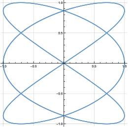 | 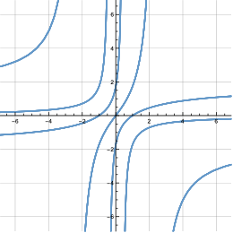 | 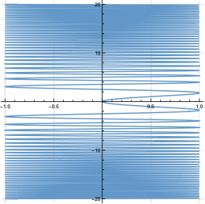 |

*Note*: The default range of the variable of parametrization is `[-10; 10]`.

### Polar Coordinates

Expressions involving the variable `\theta` (θ) are automatically parsed as polar functions `r(θ)`.
By default, polar plots are generated with `0 < \theta < 2 \pi`.

```latex
1 + \cos(\theta)
\includegraphics[width=0.8\linewidth]{tungsten_plots/plot_001}
```

| **Plot_001** |
| :---: |
|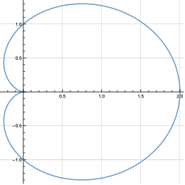 |


*Note*: For a workaround to use `\theta` in non-polar plots see the [link](#advanced-usage).

### Scatter Plots

A finite set of 2D points is parsed as a scatter plot.

```latex
(0,0), (1,1), (2,4), (3,9)
\includegraphics[width=0.8\linewidth]{tungsten_plots/plot_001}

(-1,1), (0,0), (1,-1), (4,-4)
\includegraphics[width=0.8\linewidth]{tungsten_plots/plot_002}
```

| **Plot_001** | **Plot_002** |
| :---: | :---: |
|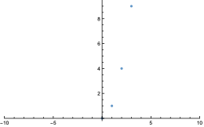| 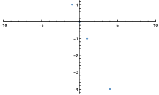|


## 3D Plotting Types

If your expression involves two independent variables or three coordinate components, Tungsten switches to 3D mode.

### Explifit Surfaces

Functions of two variables (e.g. `x` and `y`) are parsed as a 3D explicit surface.
By default, Tungsten assumes the result maps to a height coordinate `z`.

```latex
x^2 - y^2
\includegraphics[width=0.8\linewidth]{tungsten_plots/plot_001}

\frac{\sin(x \cdot y)}{2 x} \cdot \cos(x)
\includegraphics[width=0.8\linewidth]{tungsten_plots/plot_002}
```


| **Plot_001** | **Plot_002** |
| :---: | :---: |
|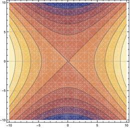| 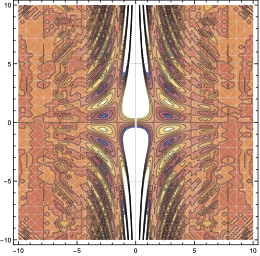|


### Implicit Surfaces

Equations relating three variables (`x`, `y` and `z`) are parsed as implicit surfaces.

```latex
x^2 + y^2 + z^2 = 10
\includegraphics[width=0.8\linewidth]{tungsten_plots/plot_001}

sin(x \cdot z) + y = 1
\includegraphics[width=0.8\linewidth]{tungsten_plots/plot_002}
```

| **Plot_001** | **Plot_002** |
| :---: | :---: |
|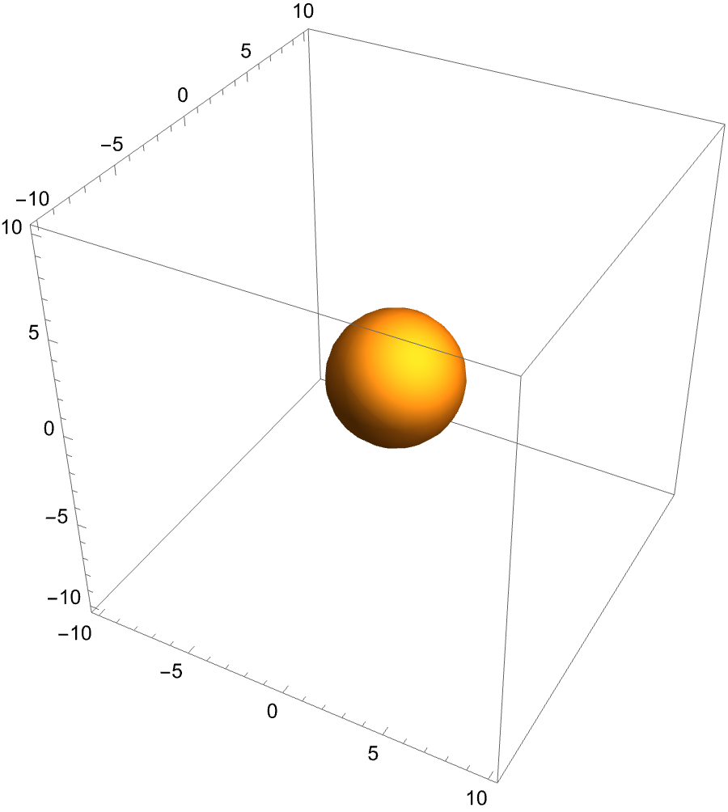| 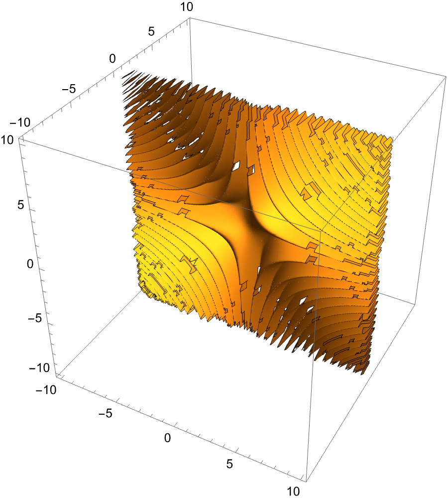|


### Parametric Surfaces and Curves

A 3-tuple dependent on **one** parameter (e.g. `t`) is parsed as a 3D curve whilst a 3-tuple dependent on **two** parameters (e.g. `u`, `v`) is parsed as a 3D surface.

```latex
Parametric Curve:
    (\cos t, \sin t, t)
    \includegraphics[width=0.8\linewidth]{tungsten_plots/plot_001}

Parametric Surface:
    (u, v, 6 - 2u + 3v)
    \includegraphics[width=0.8\linewidth]{tungsten_plots/plot_002}
```

| **Plot_001** | **Plot_002** |
| :---: | :---: |
|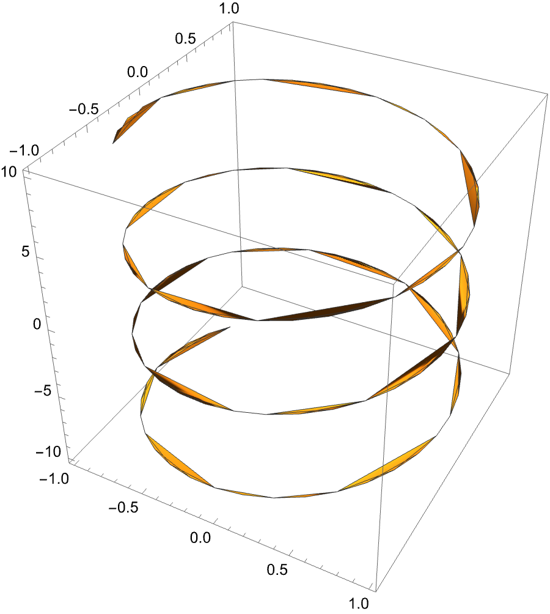| 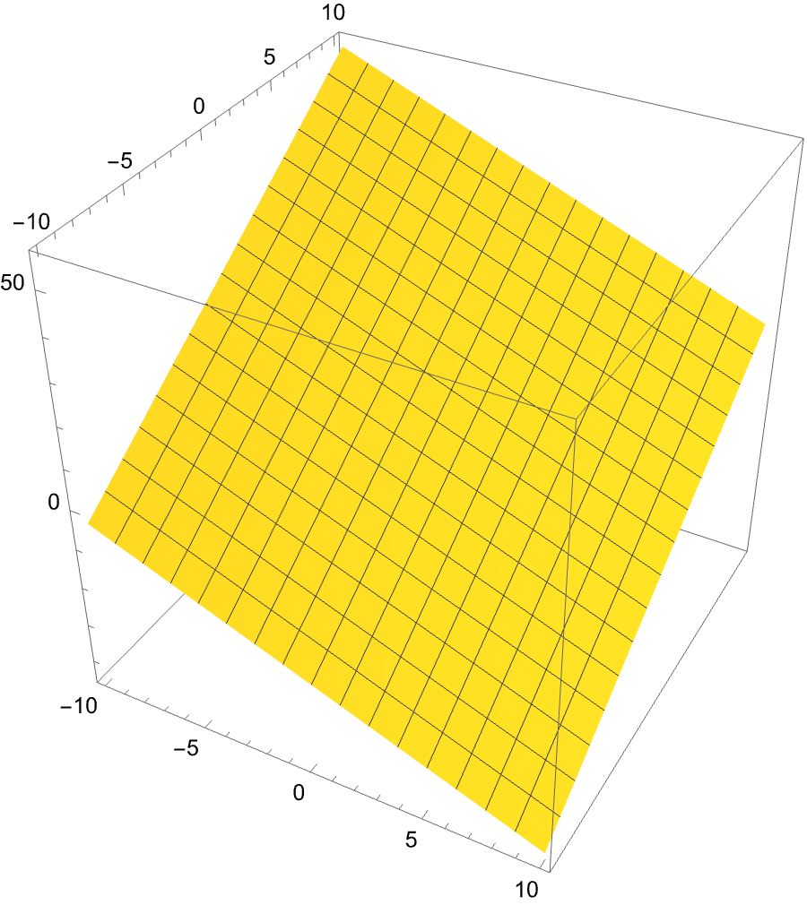|


### 3D Scatter

Finite sets of 3D points are parsed as 3D scatter plots.

```latex
(1,2,3), (4,5,6)
\includegraphics[width=0.8\linewidth]{tungsten_plots/plot_001}

(0,0,0), (0,1,1), (1,0,1), (1,1,\sqrt{2})
\includegraphics[width=0.8\linewidth]{tungsten_plots/plot_002}
```

| **Plot_001** | **Plot_002** |
| :---: | :---: |
|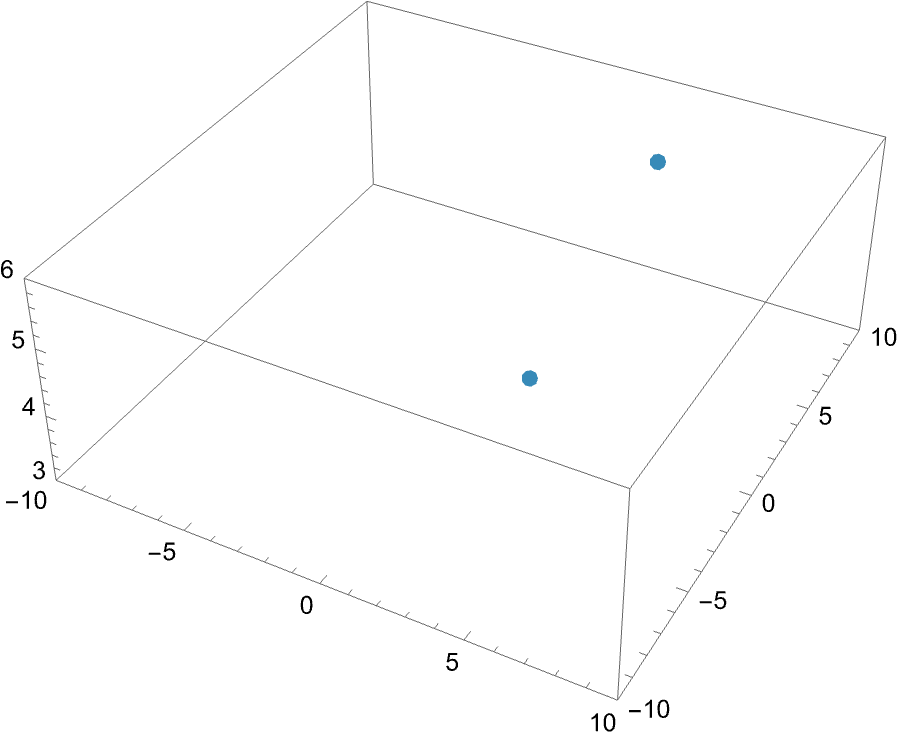| 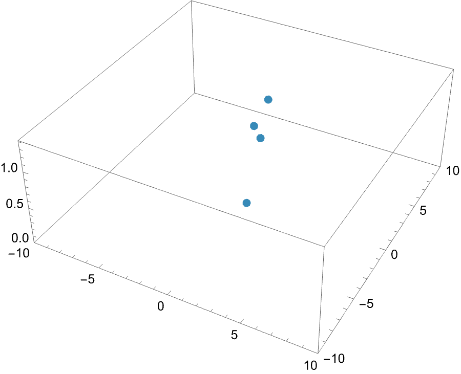|


## Multi-Series Plots

You can combine multiple expressions into a single figure.
This is done by separating expressions with a semicolon `;`.
These expressions will then be plotted on the same axes.

*Note*: All expressions must share the same dimension (i.e. you cannot mix 2D and 3D plots).

```latex
\sin x;
\cos x
\includegraphics[width=0.8\linewidth]{tungsten_plots/plot_001}

x^2 + y^2 = 1; (0, 1)
\includegraphics[width=0.8\linewidth]{tungsten_plots/plot_002}
```
| **Plot_001** | **Plot_002** |
| :---: | :---: |
|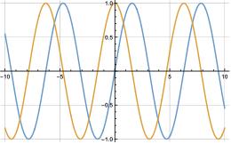| 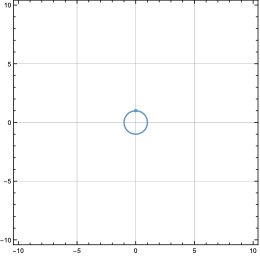|


## Advanced Usage

To gain more precise control over the plot, use the advanced configuration interface, accessible by `:TungstenPlotAdvanced`.
This will open a temporary buffer, where you can edit plot settings.

The advanced configuration buffer as it looks after inputting `\sin x` to `:TungstenPlotAdvanced` is shown underneath.

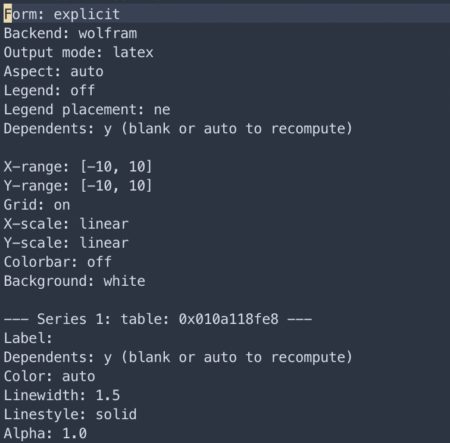

The buffer will automatically be populated with fields specific to the inputted expression.
E.g. if multiple series are inputted a series table appears for all series, if the plot is 3D a `Z-range` also appears, etc.

Saving the buffer (with `:wq`) triggers plot generation and closing the buffer (with `:q`) aborts generation of the plot.

### Global Settings

These settings affect the entire figure.

  - **Form**: Here, you can force a specific plot mode (`explicit`, `implicit`, `paramtetric`, or `polar`). Tungsten will automatically try to guess the correct form for you and insert that in the buffer. 
  - **Backend**: Override the backend for this specific plot (`wolfram`, `python` (under implementation)).
  - **Output mode**:
    - `latex`: Inserts the image code into the text (default).
    - `viewer`: Opens the image in an external viewer (for configuration of this see [Configuration](../introduction/configuration.md)).
    - `both`: Does both of the above.
  - **Aspect**: The aspect ratio of the axes (e.g., `equal`, `auto`, `1`, `1.5`).
  - **Legend**: Controls legend visibility (`auto`, `on`, `off`).
  - **Legend placement**: Directions like `ne`, `sw`, `center`, etc.
  - **Grid**: Toggle grid lines (`on`, `off`).
  - **Colorbar**: Toggle the color scale for 3D/density plots (`on`, `off`).
  - **Colormap**: The color scheme for 3D plots (e.g., `viridis`, `plasma`, `magma`, `inferno`).
  - **View elevation**: Camera height in degrees (3D only).
  - **View azimuth**: Camera rotation in degrees (3D only).
  
### Range-Settings

You can explicitly set the domain of plot variables.

  - **Format**: `[min, max]`.
  - **Keys**:
    - Cartesian: `X-range`, `Y-range`, `Z-range`
    - Parametric: `T-range`, `U-range`, `V-range`
    - Polar: `Theta-range`

**Example**:
```yaml
X-range: [-2\pi, 2\pi]
Y-range: [-1, 1]
```

### Series Settings

These settings apply to individual series (expressions) within the plot.
Each series is numbered based on the order of input, i.e. for an input of `\cos x; \sin x`, series 1 is `\cos x` and vice versa.

  - **Label**: The name appearing in the legend (only used for plots with legends)
  - **Color**: The color of the line/surface (e.g., `red`, `blue`, `#FF5733`).
  - **Linewidth**: Thickness of the line (numeric).
  - **Linestyle**: `solid`, `dashed`, `dotted`, `dashdot`.
  - **Alpha**: Transparency/opacity (`0.0` to `1.0`).
  - **Marker**: Symbol used for scatter points (`o`, `x`, `+`, `*`, `s`, `d`). These are only used for series containing points.
  - **Markersize**: Size of the above point-markers.

## Variable Resolution

Expressions often contain symbols that are not standard variables (such as constants `a`, `b`, `c`, or `\phi`).
Tungsten provides a robust system for resolving these.

### Persistent Variables

Variables defined using `:=` (as explained in [algebra](algebra.md)) are automatically substituted meaning if you have defined
```latex
a := 5
```
somewhere previously and then plot
```latex
\sin(a \cdot x)
```
Tungsten will interpret the plotting input as `\sin(5x)`. 

### The Definition Window

In an expression contains undefined symbols (e.g., `y = ax + b`, where `a` and `b` are unknown), Tungsten pauses and opens the Tungsten Definiton Window as shown underneath. 

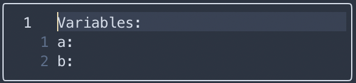
Here you can define values for the variables (e.g., `a: 0.5`, `b: 2`).

If you use "non-standard" variables in plots Tungsten will have a hard time finding out which are variables and which are constants.
E.g. if we try to plot `y = a \cdot p + b`, Tungsten will not know if `y` depends on `a`, `p` or `b`. Hence the definition window will look as:

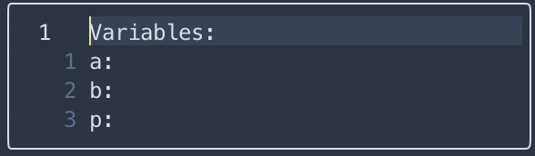

To let Tungsten know that we wish to use `p` as our variable, we simply fill out the values of `a:` and `b:` and leave `p:` blank. To save our definitions we simply hit `:wq` and close the window, afterwhich the plot continues with the given definitions.


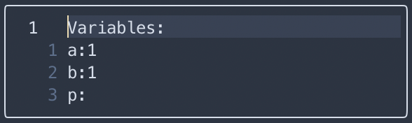
You will end up with a plot like:
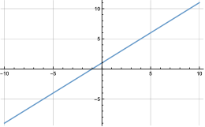


## Output and File Management

### Directory structure

Tungsten keeps your project organized by creating a dedicated folder for all generated plots.
To do this, Tungsten looks for a TeX root file by
  - Scanning the working directory for a file containing `\documentclass`, if such a file is found, this is deemed the root.
  - If no file with `\documentclass` is found, Tungsten will look for a file contining a magic comment saying `%!TEX root = <main.tex>`.
After the TeX root file is found it creates a `tungsten_plots/` directory relative to that root.

### Filename Generation

By default, Tungsten uses sequential naming of plots (i.e. `plot_001.pdf`, `plot_002.pdf`, etc.).
If you delete a file, Tungsten may reuse the number to fill gaps.

You are also able to use timestamp-naming by changing `config.plotting.naming` to `timestamp` as explained in [Configuration](reference/config.md).

### Image Format

  - 2D plots: Generated as `.PDF` for infinite vector resolution in LaTeX documents.
  - 3D plots: Generated as `.png`.

## Backend Comparison

Tungsten supports the two backends, `Wolfram` and `Python`.
You can switch between them in the config (see [Configuration](reference/config.md) or on a per-plot basis as explained above.

To check which backends are available on your system you can run the `:TungstenPlotCheck` command.

### Capability Matrix

| Feature | Dimension | Wolfram | Python |
| :--- | :---: | :---: | :---: |
| **Explicit Functions** | 2D | ✅ | ✅ |
| | 3D | ✅ | ⚠️ (Restricted) |
| **Implicit Equations** | 2D | ✅ | ✅ |
| | 3D | ✅ | ❌ |
| **Parametric Curves** | 2D | ✅ | ✅ |
| | 3D | ✅ | ✅ |
| **Polar Coordinates** | 2D | ✅ | ✅ |
| **Scatter / Points** | 2D | ✅ | ✅ |
| | 3D | ✅ | ✅ |
| **Inequalities** | 2D | ✅ | ❌ |
| | 3D | ✅ | ❌ |
